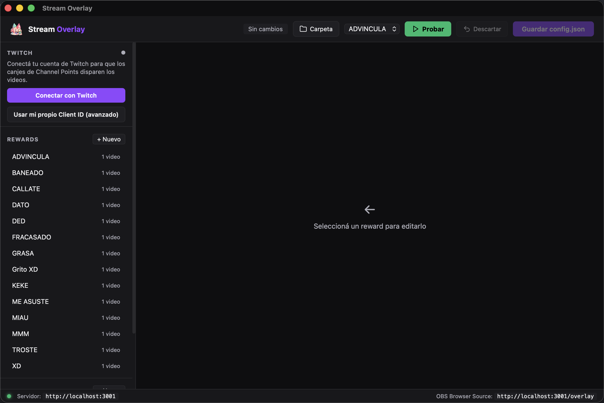
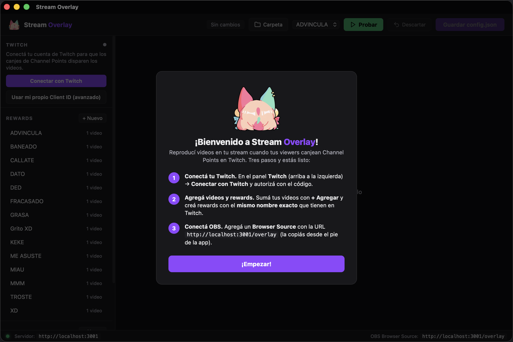

<div align="center">


# Stream Overlay

**Reproducí videos en tu stream cuando tus viewers canjean Channel Points en Twitch.**
App de escritorio self-hosted, sin servicios externos y sin límite de videos.

[](https://github.com/h0kd/h0kd-overlay/releases/latest)

<br/>



</div>

---

## ✨ Qué hace

- 🎬 **Dispara videos** en un overlay de OBS cuando canjean un reward de Channel Points.
- 🔀 **Varios videos por reward**: elige 1 al azar, o reproduce **todos a la vez**.
- 📐 **Tamaño, posición y volumen** por reward, respetando *safe zones* (que no tape tu webcam).
- ⏱️ **Duración automática**: detecta cuánto dura cada video para que no se corte.
- 🟣 **Conexión directa a Twitch** (EventSub) — **no necesitás Streamer.bot** ni nada más.
- 🔄 **Auto-actualizaciones**: te avisa cuando hay una versión nueva y se actualiza sola.

---

## ⬇️ Descargar e instalar

1. Bajá el instalador desde **[la última Release](https://github.com/h0kd/h0kd-overlay/releases/latest)** (`.exe` o `.msi`).
2. Ejecutalo.

   > **Nota:** la primera vez, Windows SmartScreen puede avisar que la app no es reconocida
   > (todavía no está firmada digitalmente). Hacé clic en **Más info → Ejecutar de todas formas**.

3. Abrí **Stream Overlay**. La primera vez te muestra una guía rápida de 3 pasos.

> Tu configuración y videos quedan en una carpeta tuya
> (`%APPDATA%\Stream Overlay`). El botón **Carpeta** de la app la abre.

---

## 🚀 Cómo usar

La primera vez, la app te recibe con una guía rápida:

<div align="center"></div>

### 1. Conectá tu Twitch

En el panel **Twitch** (arriba a la izquierda) → **Conectar con Twitch**. La app te da un
código: andá a **[twitch.tv/activate](https://www.twitch.tv/activate)**, ingresalo y autorizá.
Listo — se reconecta solo la próxima vez.

### 2. Agregá tus videos y rewards

- Sumá tus videos (`.mp4` o `.webm`) con **+ Agregar**.
- Creá un reward con el **mismo nombre exacto** que tiene en Twitch (mayúsculas incluidas).
- Ajustá videos, modo de reproducción, volumen, tamaño y duración.

### 3. Conectá OBS

Agregá un **Browser Source** en OBS con esta URL:

```
http://localhost:3001/overlay
```

Width `1920` / Height `1080` (o tu resolución). Desmarcá *"Shutdown source when not visible"*
y *"Refresh browser when scene becomes active"*, y poné el source encima de todo.

> La app tiene que estar abierta para que el overlay funcione.

**Probá** un reward desde el panel (botón **▶ Probar**) sin gastar Channel Points.

---

## ❓ Problemas comunes

| Problema | Solución |
|----------|----------|
| El canje no dispara el video | El nombre del reward debe ser **idéntico** al de Twitch (mayúsculas incluidas). |
| "Sin overlay conectado" al probar | El Browser Source debe apuntar a `http://localhost:3001/overlay` y la app estar abierta. |
| "Suscripción rechazada" | Autorizá con tu cuenta de **broadcaster** (la que tiene los Channel Points). |
| No se ve el video | Verificá que el archivo exista (el panel marca ⚠ si falta) y que sea `.mp4`/`.webm`. |
| Sin audio | Habilitá el audio del Browser Source en OBS y revisá el volumen del reward. |

---

## 🛠️ Para desarrolladores

<details>
<summary>Compilar desde el código</summary>

Multiplataforma (Windows y macOS). Requiere [Rust](https://rustup.rs) y el Tauri CLI:

```bash
cargo install tauri-cli --version "^2"
```

- **Windows:** Microsoft C++ Build Tools + WebView2 (viene con Windows 10/11).
- **macOS:** Xcode Command Line Tools (`xcode-select --install`).

```bash
cd src-tauri
cargo tauri dev      # desarrollo (o: cargo run)
cargo tauri build    # genera los instaladores del SO actual
```

**Estructura:**

```
src-tauri/src/lib.rs      ← comandos Tauri + arranque
src-tauri/src/server.rs   ← server axum (HTTP + WebSocket) en :3001
src-tauri/src/twitch.rs   ← OAuth Device Code Flow + cliente EventSub
src/control.html          ← panel de control (UI nativa)
src/overlay.html          ← overlay servido en /overlay
```

**Releases:** al pushear un tag `v*`, GitHub Actions compila el instalador de Windows,
lo firma para el auto-updater y crea un Release en borrador (ver `.github/workflows/release.yml`).

</details>

---

## 📄 Licencia

[MIT](LICENSE) — usalo, modificalo y compartilo libremente.
